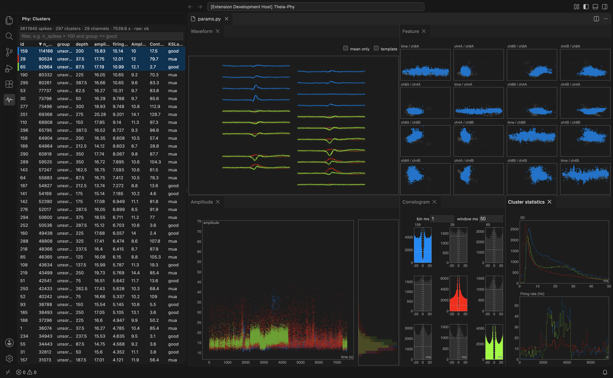
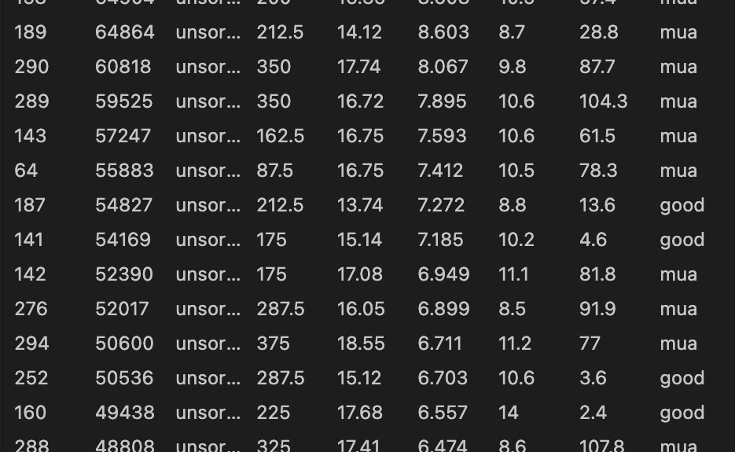
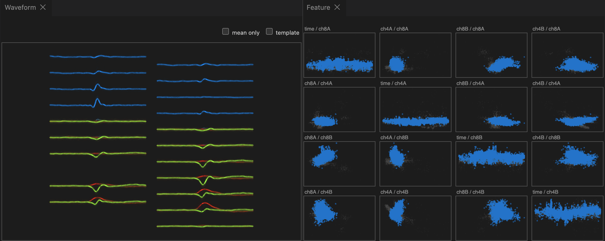
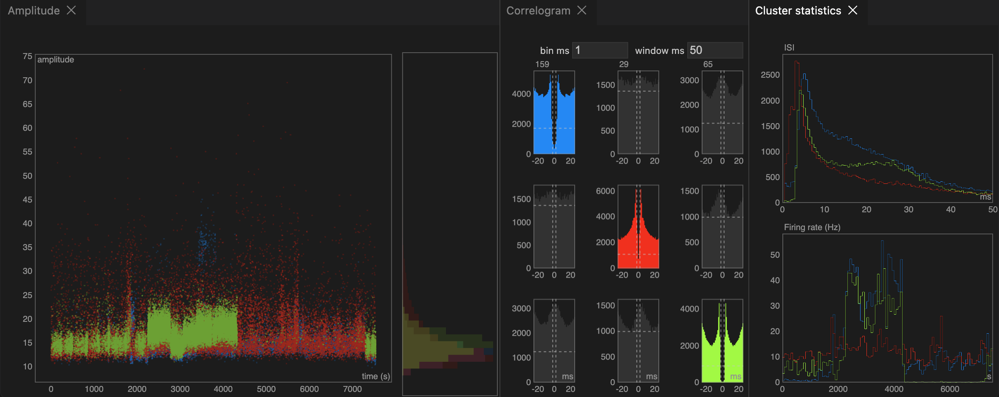

# phy-vscode

A VS Code extension for browsing [phy](https://phy.readthedocs.io/)/Kilosort spike-sorting datasets, written in pure TypeScript with no Python at runtime.

> [!WARNING]
> **This is a proof of concept.** It's an experiment in whether phy's views can run natively inside VS Code. It isn't a replacement for phy.
> - **Read-only.** You can browse and select clusters. Curation (merge, split, relabel, undo) isn't implemented, and nothing is written back to the dataset.
> - **Incomplete.** phy's Similarity, Trace, Probe and Raster views are missing.
> - **Unstable.** Expect bugs and breaking changes. The mod API (`packages/api`, `0.x`) can change between minor versions.
> - **Not on the VS Code Marketplace.** Download the `.vsix` from [Releases](../../releases) or build it from source (see [Install](#install)).
> - Tested on one Kilosort 4 dataset and synthetic fixtures. Check results against phy before you rely on them.



## Documentation

- **[User guide](docs/user-guide.md):** opening a dataset, the Clusters table and its filter, every view and its controls, layout, commands, troubleshooting.
- **[Writing mods](docs/mods.md):** add a table column, a statistics panel or a whole view with a single pasted file, then the full plugin reference.

**Quick start:** install the `.vsix` (see [Install](#install)), run **Phy: Open Dataset…** and pick the folder with `params.py`, click clusters in the **Phy** activity-bar panel (Alt+↓/↑ steps through them).

## Features

**Clusters table:** a sortable, filterable table with multi-select. Each selected cluster gets a colour that the plot views reuse.



**Waveform and Feature views:** waveforms are drawn at their probe positions (raw data, or templates as a fallback). The feature view shows a grid of PC-feature scatter plots plus feature-vs-time panels.



**Amplitude, Correlogram and Cluster statistics views:** amplitude vs time with a marginal histogram; auto- and cross-correlograms with adjustable bin and window; ISI and firing-rate histograms.



**Mods:** add table columns, statistics histograms and whole plot views from a plugin folder (`Phy: New Plugin…`, `Phy: Reload Plugins`) or from another VS Code extension. A plugin can be one pasted JavaScript file; see [docs/mods.md](docs/mods.md).

Design: [docs/superpowers/specs/2026-10-03-phy-vscode-extension-design.md](docs/superpowers/specs/2026-10-03-phy-vscode-extension-design.md)

## Requirements

- VS Code 1.95 or newer (desktop, including Remote-SSH)
- Node.js 20 or newer and npm, only if you build from source

## Install

### Option A: download the `.vsix` (easiest)

Download `phy-vscode-<version>.vsix` from the [latest release](../../releases/latest). Then install it in VS Code by either:
- **Extensions view:** open `⋯` → **Install from VSIX…** and pick the downloaded file.
- **Command line:** `code --install-extension phy-vscode-<version>.vsix`

**Remote-SSH:** the extension runs on the machine that has the data. Connect to the remote first, then install the `.vsix` from the Extensions view; VS Code installs it on the remote side.

To update, download the newer `.vsix` from [Releases](../../releases) and install it the same way.

### Option B: build the `.vsix` yourself

```bash
git clone <this repo> phy-vscode && cd phy-vscode
npm install
npm run package          # writes packages/extension/phy-vscode-0.0.1.vsix
```

Install `packages/extension/phy-vscode-0.0.1.vsix` as in Option A. To update, pull, run `npm run package` again and reinstall.

### Option C: run from source (development)

```bash
npm install
```

Open the repo folder in VS Code and press **F5** ("Run phy-vscode"). It builds first, then starts an Extension Development Host window with the extension loaded.

## Usage

- **Command Palette:** run **Phy: Open Dataset…** and pick the folder that contains `params.py` (the Kilosort/phy output folder).
- **Explorer:** right-click a `params.py` → **Open With…** → **Phy Dataset**. Ordinary Python editing of `params.py` is unaffected.

The **Phy** activity-bar icon opens the **Clusters** view, a sortable, filterable table of the active dataset.
- **Selecting:** click to select, Ctrl/Cmd-click to add, Shift-click for a range; ↑/↓ move through the table and Shift+↑/↓ extend.
- **Next/previous anywhere:** **Alt+↓ / Alt+↑** (`phy.selectNext` / `phy.selectPrevious`) select the next or previous cluster in the table's current order from anywhere in the dataset editor. You can rebind them in Keyboard Shortcuts.
- **Filter syntax:** for example `n_spikes > 100 and group == good`.

The dataset editor tiles the Waveform, Feature, Correlogram, Amplitude and Cluster statistics views.
- **Layout:** drag tabs to re-dock. **Phy: Toggle View…** hides or shows a view.
- **Interaction:** wheel zooms (Shift+wheel zooms x only), dragging pans, double-click resets.
- **Persistence:** layout, table sort and filter, and view settings are remembered per dataset.

Notes:
- **Raw data:** the raw `.bin` is found through `dat_path` in `params.py`; relative paths are resolved against the `params.py` folder. If the raw file is missing or its size doesn't match `n_channels_dat`/`dtype`/`offset`, the dataset still opens. The Waveform view's header shows the reason, and the view falls back to templates.
- **Fortran-ordered files:** large Fortran-ordered `.npy` files (e.g. `pc_features.npy` from MATLAB Kilosort) are converted once into a C-order cache in VS Code's extension storage. The dataset folder is never written to.

## Development

Run from the repo root:

| Command | What it does |
|---|---|
| `npm test` | Unit tests (vitest; generates a synthetic fixture first) |
| `npm run typecheck` | `tsc --noEmit` |
| `npm run build` | Bundles `dist/extension.cjs` and `dist/worker.cjs` with esbuild |
| `npm run test:smoke -w packages/extension` | Launches a real VS Code (downloaded into `.vscode-test/`) against the fixture |
| `npm run bench -w packages/extension` | Performance-gate benchmarks |
| `npm run check:real -w packages/extension -- <dataset dir> [--dat <raw.bin>]` | Opens a real dataset and times every view (`--dat` overrides `dat_path` without touching the dataset) |

### Publishing a release

Bump `version` in `packages/extension/package.json`, then:

```bash
npm run package
git tag v<version> && git push origin v<version>
gh release create v<version> packages/extension/phy-vscode-<version>.vsix --title "v<version>" --notes "Proof of concept, read-only."
```

### Python goldens (dev only, optional)

Tests compare against checked-in JSON goldens produced by phylib/scipy. You only need Python to regenerate them. The environment is managed by [uv](https://docs.astral.sh/uv/):

```bash
npm run fixtures -w packages/extension
uv run --project tools/goldens python tools/goldens/make_goldens.py
```

## License

[MIT](LICENSE)
